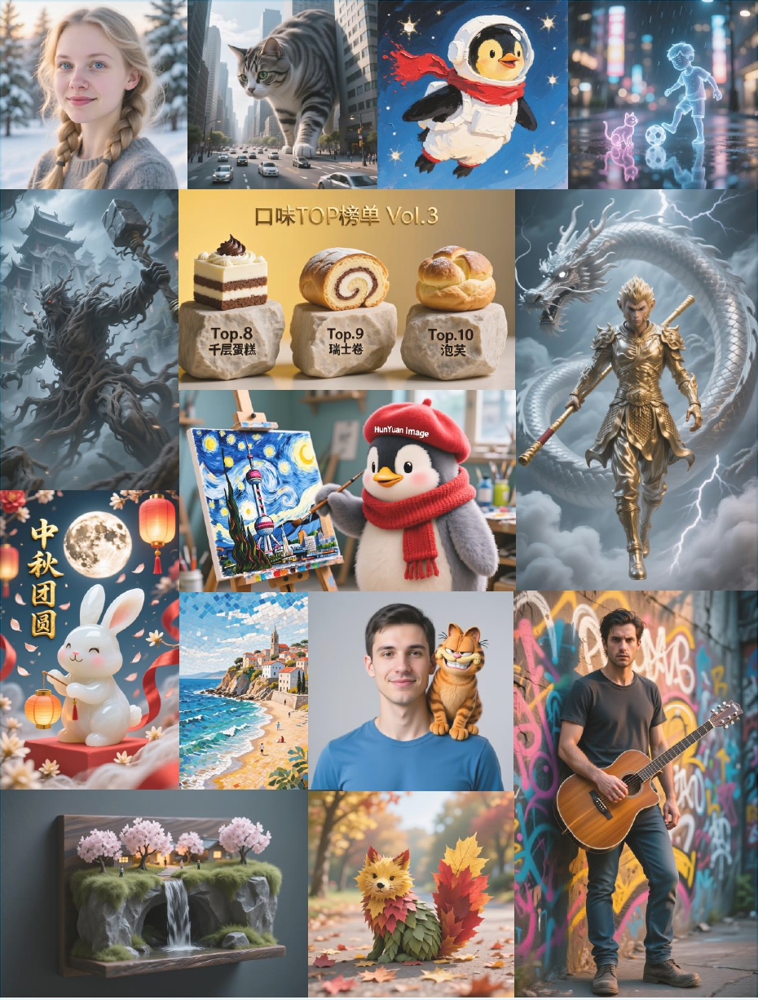

[中文阅读](./README_CN.md)

<p align="center">
  
</p>

<div align="center">

# HunyuanImage-2.1: An Efficient Diffusion Model for High-Resolution (2K) Text-to-Image Generation​

</div>


<p align="center"> &nbsp&nbsp🤗 <a href="https://huggingface.co/tencent/HunyuanImage-2.1">HuggingFace</a>&nbsp&nbsp | 
💻 <a href="https://hunyuan.tencent.com/modelSquare/home/play?modelId=286&from=/visual">Official website(官网) Try our model!</a>&nbsp&nbsp
</p>


<p align="center">
    👏 Join our <a href="assets/WECHAT.md" target="_blank">WeChat</a> and <a href="https://discord.com/invite/dNBrdrGGMa">Discord</a>
</p>


-----

This repo contains PyTorch model definitions, pretrained weights and inference/sampling code for our HunyuanImage-2.1. You can <span style="color:red">**directly try our model**</span> on [Official website(官网)](https://hunyuan.tencent.com/modelSquare/home/play?modelId=286&from=/visual) and find more visualizations on our [project page](https://hunyuan.tencent.com/image/en?tabIndex=0).


<div align="center">
  
</div>

## 🔥🔥🔥 Latest Updates
- October 31, 2025: 🚀 Optimized FP8 inference now available via [AngelSlim](https://github.com/Tencent/AngelSlim), delivering up to 40% faster generation!
- September 18, 2025: ✨ Try the [PromptEnhancer-32B model](https://huggingface.co/PromptEnhancer/PromptEnhancer-32B) for higher-quality prompt enhancement!​.
- September 18, 2025: ✨ [ComfyUI workflow of HunyuanImage-2.1](https://github.com/KimbingNg/ComfyUI-HunyuanImage2.1) is available now!
- September 16, 2025: 👑 We achieved the Top1 on Arena's leaderboard for text-to-image open-source models. [Leaderboard](https://artificialanalysis.ai/text-to-image/arena/leaderboard-text)
- September 12, 2025: 🚀 Released FP8 quantized models! Making it possible to generate 2K images with only 24GB GPU memory!
- September 8, 2025: 🚀 Released inference code and model weights for HunyuanImage-2.1.

## Introduction
We are excited to introduce **HunyuanImage-2.1**, a 17B text-to-image model that is capable of generating **2K (2048 × 2048) resolution** images. 

<!-- Leveraging an extensive dataset and structured captions involving multiple expert models, we significantly enhance text-image alignment capabilities. The model employs a highly expressive VAE with a (32 × 32) spatial compression ratio, substantially reducing computational costs. -->

Our architecture consists of two stages:
1. **​Base text-to-image Model**:​​ The first stage is a text-to-image model that utilizes two text encoders: a multimodal large language model (MLLM) to improve image-text alignment, and a multi-language, character-aware encoder to enhance text rendering across various languages. 
2. **Refiner Model**: The second stage introduces a refiner model that further enhances image quality and clarity, while minimizing artifacts. 
<!-- 
Additionally, we developed the PromptEnhancer module to further boost model performance, and employed meanflow distillation for efficient inference. HunyuanImage-2.1 demonstrates robust semantic alignment and cross-scenario generalization, leading to improved consistency between text and image, enhanced control of scene details, character poses, and expressions, and the ability to generate multiple objects with distinct descriptions. -->

👑 We achieved the **Top1** on Arena's leaderboard for text-to-image open-source models.

<div align="center">
  
</div>
 

## 🎉 HunyuanImage-2.1 Key Features

- **High-Quality Generation**: Efficiently produces ultra-high-definition (2K) images with cinematic composition.
- **Multilingual Support**: Provides native support for both Chinese and English prompts.
- **Advanced Architecture**: Built on a multi-modal, single- and dual-stream combined DiT (Diffusion Transformer) backbone.
- **Glyph-Aware Processing**: Utilizes ByT5's text rendering capabilities for improved text generation accuracy.
- **Flexible Aspect Ratios**: Supports a variety of image aspect ratios (1:1, 16:9, 9:16, 4:3, 3:4, 3:2, 2:3).
- **Prompt Enhancement**: Automatically rewrites prompts to improve descriptive accuracy and visual quality.


## 📜 System Requirements

**Hardware and OS Requirements:**
- NVIDIA GPU with CUDA support.

  **Minimum requrement for now:** 24 GB GPU memory for 2048x2048 image generation.
  
  > **Note:** The memory requirements above are measured with model CPU offloading and FP8 quantization enabled. If your GPU has sufficient memory, you may disable offloading for improved inference speed.
- Supported operating system: Linux.


## 🛠️ Dependencies and Installation

1. Clone the repository:
```bash
git clone https://github.com/Tencent-Hunyuan/HunyuanImage-2.1.git
cd HunyuanImage-2.1
```

2. Install dependencies:
```bash
pip install -r requirements.txt
pip install flash-attn==2.7.3 --no-build-isolation
```

## 🧱 Download Pretrained Models

The details of download pretrained models are shown [here](ckpts/checkpoints-download.md).

## 🔑 Usage

### Prompt Enhancement

Prompt enhancement plays a **crucial role** in enabling our model to generate high-quality images. By writing longer and more detailed prompts, the generated image will be significantly improved. We encourage you to craft comprehensive and descriptive prompts to achieve the best possible image quality. 

We highly recommend you to try the [PromptEnhancer-32B model](https://huggingface.co/PromptEnhancer/PromptEnhancer-32B) for higher-quality prompt enhancement.


### Text to Image
HunyuanImage-2.1 **only supports 2K** image generation (e.g. 2048x2048 for 1:1 images, 2560x1536 for 16:9 images, etc.).
Generating images with 1K resolution will result in artifacts.

Additionally, we **highly recommend** using the full generation pipeline for better quality (i.e. enabling prompt enhancement and refinment).


| model type               | model name                | description                             | num_inference_steps | guidance_scale | shift |
|--------------------------|---------------------------|-----------------------------------------|---------------------|----------------|-------|
| Base text-to-image Model | hunyuanimage2.1           | Undistilled model for the best quality. | 50                  | 3.5            | 5     |
| Distilled text-to-image Model | hunyuanimage2.1-distilled | Distilled model for faster inference    | 8                   | 3.25           | 4     |
| Refiner                  | hunyuanimage-refiner      | The refiner model                       | N/A                 | N/A            | N/A   |

### FP8 Inference

Enable FP8 quantized inference with [Angelslim](https://github.com/Tencent/AngelSlim) to significantly reduce GPU memory usage and speed up generation.  
- **Recommended:** `fp8_mode="weight_only"` for optimal image quality and memory savings  
- **Alternative:** `fp8_mode="w8a8"` for maximum speed and lower memory usage (may slightly lower quality)  
- `use_fp8=True` will be deprecated and now maps to `"weight_only"`.

### Example:

```python
import os
os.environ['PYTORCH_CUDA_ALLOC_CONF'] = 'expandable_segments:True'
import torch
from hyimage.diffusion.pipelines.hunyuanimage_pipeline import HunyuanImagePipeline

# Supported model_name: hunyuanimage-v2.1, hunyuanimage-v2.1-distilled
model_name = "hunyuanimage-v2.1"
# Supported fp8_mode: weight_only, w8a8
pipe = HunyuanImagePipeline.from_pretrained(model_name=model_name, fp8_mode="w8a8")
pipe = pipe.to("cuda")

# The input prompt
prompt = "A cute, cartoon-style anthropomorphic penguin plush toy with fluffy fur, standing in a painting studio, wearing a red knitted scarf and a red beret with the word \"Tencent\" on it, holding a paintbrush with a focused expression as it paints an oil painting of the Mona Lisa, rendered in a photorealistic photographic style."


# Generate with different aspect ratios
aspect_ratios = {
    "16:9": (2560, 1536),
    "4:3": (2304, 1792),
    "1:1": (2048, 2048),
    "3:4": (1792, 2304),
    "9:16": (1536, 2560),
}

width, height = aspect_ratios["1:1"]

image = pipe(
    prompt=prompt,
    width=width,
    height=height,
    # disable the reprompt if you already use the prompt enhancement to enhance the prompt
    use_reprompt=False,  # Enable prompt enhancement (which may result in higher GPU memory usage)
    use_refiner=True,   # Enable refiner model
    # For the distilled model, use 8 steps for faster inference.
    # For the non-distilled model, use 50 steps for better quality.
    num_inference_steps=8 if "distilled" in model_name else 50, 
    guidance_scale=3.25 if "distilled" in model_name else 3.5,
    shift=4 if "distilled" in model_name else 5,
    seed=649151,
)

image.save("generated_image.png")
```

## More Cases
Our model can follow complex instructions to generate high‑quality, creative images. 

<div align="center">
  
</div>

We recommend using longer, more detailed prompts. You can also try the prompts we provide.
 
<p align="center">
<table>
<thead>
<tr>
    <th>Index</th>  <th>User Prompt</th> <th>Image</th>
</tr>
</thead>
<tbody>
<tr>
    <td>1</td> <td>宏伟教堂的内部，穹顶下方的中央矗立着一尊小巧的维纳斯雕像，微微侧对镜头。雕像没有双手，布满裂纹，表面若干古老的水泥片剥落，露出内部真人质感的牛奶肌肤。雕像穿着薄薄的白色婚纱，在雕像的身后，一只浮空水泥断手轻轻提起长长的婚纱拖尾；在雕像的头顶上方，另一只浮空水泥断手正为她戴上一个由白色花朵组成的花环，雕像本身是没有双手的。教堂穹顶上布满彩色玻璃窗，一束阳光从上往下照射到雕像上，形成丁达尔效应，光斑点点洒在雕像的脸庞和胸前。充满神性的光辉，背景微微虚化，物体的边缘模糊柔和。拉斐尔前派的梦幻朦胧美学风格。</td> <td></td>
</tr>
<tr>
    <td>2</td> <td>A hyper-realistic photograph of a crystal ball diorama sitting atop fluffy forest moss and surrounded by scattered sunlight. Inside, detailed diorama features a Tencent meeting room, an animated chat bubble sculpture, and several joyful penguins—one wearing a graduation cap, others playing soccer and waving tiny banners. The base of the crystal sphere boldly presents ""Tencent"" in large, crisp, white 3D letters. Background is softly blurred and bokeh-rich, emphasizing the cute, vibrant details of the sphere.</td>  <td></td>
</tr>
<tr>
    <td>3</td> <td>A close-up portrait of an elderly Italian man with deeply wrinkled skin, expressive hazel eyes, and a neatly trimmed white mustache. His olive-toned complexion shows the marks of sun and age, and he wears a flat cap slightly tilted to the side. He smiles faintly, revealing warmth and wisdom, while holding a small espresso cup in one hand. The softly blurred background shows a rustic stone wall with climbing ivy, captured in a realistic photography style.</td> <td></td>
</tr>
<tr>
    <td>4</td> <td>An open vintage suitcase on a neutral, softly lit background. The suitcase is made of deep brown, worn leather with visible scuffs and creases, and its interior is lined with dark, plush fabric. Inside the suitcase is a meticulously crafted miniature landscape of China, featuring the Great Wall of China winding across model mountains, the pagoda roofs of the Forbidden City, and a representation of the terracotta army, all interwoven with vibrant green rice paddies.  On the side of the suitcase, a text "China" is labeled. The entire diorama is bathed in warm, ethereal light, with a dreamy lens bloom and soft, glowing highlights. Photorealistic style, ultra-detailed textures, cinematic lighting.</td> <td></td>
</tr>
</tbody>
</table>
</p>


 To improve the quality and detail of generated images, we use a prompt rewriting model. This model automatically enhances user-provided text prompts by adding detailed and descriptive information.
<p align="center">
<table>
<thead>
<tr>
    <th>Index</th>  <th>User Prompt</th> <th>Prompt Enhanced</th> <th>Image</th>
</tr>
</thead>
<tbody>
<tr>
    <td>1</td> <td>Wildlife poster for Serengeti plains. Wide-eyed chibi explorer riding friendly lion cub. 'Serengeti: Roar of Adventure' in whimsical font. 'Where Dreams Run Wild' tagline. Warm yellows and soft browns.</td> <td> A wildlife poster design for the Serengeti plains features a central illustration of a chibi-style explorer riding a lion cub, set against a backdrop of rolling hills. At the top of the composition, the title "Serengeti: Roar of Adventure" is displayed in a large, whimsical font with decorative, swirling letters. The main scene depicts a wide-eyed chibi explorer, characterized by a large head and a small body, sitting atop a friendly lion cub. The explorer wears a green explorer's hat, a backpack, and holds onto the cub's mane, looking forward with a look of wonder. The lion cub, with a light brown mane and a smiling expression, strides forward, its body rendered in warm orange tones. In the background, the Serengeti plains are illustrated with rolling hills and savanna grass, all in shades of warm yellow and soft brown. Below the main illustration, the tagline "Where Dreams Run Wild" is written in a smaller, elegant script. The overall presentation is that of a poster design, combining a cute chibi illustration style with playful, whimsical typography.</td> <td></td>
</tr>
<tr>
    <td>2</td> <td>Energetic poster for New York City. Anime businesswoman hailing a taxi with skyscrapers and Times Square signs around. 'NYC: Bright Ambitions' in urban graffiti font. 'Own Every Dream' tagline. Saturated yellows, reds, and sharp blues.</td> <td>An energetic poster for New York City unfolds, featuring a dynamic scene with an anime-style businesswoman in the midst of hailing a taxi. The central figure is a young woman with large, expressive eyes and dark hair styled in a bob, wearing a professional blue business suit with motion lines indicating movement. She stands on a bustling street, her arms outstretched as she calls for a classic yellow taxi cab that is approaching. In the background, towering skyscrapers with sleek, anime-inspired architecture rise into the sky, adorned with vibrant, glowing billboards and neon signs characteristic of Times Square. Across the top of the poster, the text "NYC: Bright Ambitions" is displayed in a large, stylized urban graffiti font, with spray-paint-like edges. Below this main title, the tagline "Own Every Dream" is written in a smaller, clean font. The entire composition is rendered with saturated colors, dominated by bright yellows, reds, and sharp blues. The overall presentation is a fusion of anime illustration and graphic design.</td> <td></td>
</tr>
<tr>
    <td>3</td> <td>An artistic studio portrait captures a high fashion model in a striking, dynamic pose. Her face is a canvas for avant-garde makeup, defined by bold, geometric applications of primary colors. She wears a sculptural, unconventional garment, emphasizing clean lines and form. The scene is illuminated by dramatic studio lighting, creating sharp contrasts and highlighting her features against an abstract, blurred background of colors. The image is presented in a realistic photography style.</td> <td> An artistic studio portrait captures a high fashion model in a striking, dynamic pose, her body twisted with one arm raised high to convey energy and movement. Her face serves as a canvas for avant-garde makeup, featuring bold, geometric applications of primary colors; vibrant yellow triangles are painted on her forehead, and electric blue lines accentuate her eye sockets. She wears a sculptural, unconventional garment made of a stiff, matte white fabric, with asymmetrical panels that wrap around her torso, emphasizing clean lines and form. Illuminated by dramatic studio lighting, with a strong beam from the side casting sharp shadows and highlighting the contours of her face and body against an abstract, blurred background of purples and oranges, creating a bokeh effect. Realistic photography style. </td> <td></td>
</tr>
<tr>
    <td>4</td> <td>An environmental portrait of a chef, captured with a focused expression in a bustling kitchen. He holds culinary tools, his gaze fixed on his work, embodying passion and creativity. The background is a blur of motion with stainless steel counters, all illuminated by a warm ambient light. The image is presented in a realistic photography style.</td> <td> An environmental portrait of a male chef in the midst of work within a bustling kitchen. The chef, as the central subject and viewed from the chest up, has a focused expression with a furrowed brow, his gaze directed downward at the culinary tools he holds. He wears a professional white chef‘s jacket and a traditional toque, with flour lightly dusting his face and clothes. In his hands, he grips a large chef’s knife and a metal spatula, poised over an unseen cooking surface. The background is a dynamic blur of motion, with out-of-focus shapes of stainless steel counters, pots, and other kitchen equipment suggesting a busy environment. Warm ambient light from overhead fixtures casts a golden hue, creating highlights on the chef‘s jacket and the tools. Realistic photography style, characterized by a shallow depth of field that emphasizes the subject while conveying the energy and creativity of the kitchen. </td>  <td></td>
</tr>
</tbody>
</table>
</p>

<!-- <p align="center">
  
</p> -->


## 📈 Comparisons

### SSAE Evaluation
SSAE (Structured Semantic Alignment Evaluation) is an intelligent evaluation metric for image-text alignment based on advanced multimodal large language models (MLLMs). We extracted 3500 key points across 12 categories, then used multimodal large language models to automatically evaluate and score by comparing the generated images with these key points based on the visual content of the images. Mean Image Accuracy represents the image-wise average score across all key points, while Global Accuracy directly calculates the average score across all key points.
<p align="center">
<table>
<thead>
<tr>
    <th rowspan="2">Model</th>  <th rowspan="2">Open Source</th> <th rowspan="2">Mean Image Accuracy</th> <th rowspan="2">Global Accuracy</th> <th colspan="4" style="text-align: center;">Primary Subject</th> <th colspan="3" style="text-align: center;">Secondary Subject</th> <th colspan="2" style="text-align: center;">Scene</th> <th colspan="3" style="text-align: center;">Other</th>
</tr>
<tr>
    <th>Noun</th> <th>Key Attributes</th> <th>Other Attributes</th> <th>Action</th> <th>Noun</th> <th>Attributes</th> <th>Action</th> <th>Noun</th> <th>Attributes</th> <th>Shot</th> <th>Style</th> <th>Composition</th>
</tr>
</thead>
<tbody>
<tr>
    <td>FLUX-dev</td> <td>✅</td> <td>0.7122</td> <td>0.6995</td> <td>0.7965</td> <td>0.7824</td> <td>0.5993</td> <td>0.5777</td> <td>0.7950</td> <td>0.6826</td> <td>0.6923</td> <td>0.8453</td> <td>0.8094</td> <td>0.6452</td> <td>0.7096</td> <td>0.6190</td>
</tr>
<tr>
    <td>Seedream-3.0</td> <td>❌</td> <td>0.8827</td> <td>0.8792</td> <td>0.9490</td> <td>0.9311</td> <td>0.8242</td> <td>0.8177</td> <td>0.9747</td> <td>0.9103</td> <td>0.8400</td> <td>0.9489</td> <td>0.8848</td> <td>0.7582</td> <td>0.8726</td> <td>0.7619</td>
</tr>
<tr>
    <td>Qwen-Image</td> <td>✅</td> <td>0.8854</td> <td>0.8828</td> <td>0.9502</td> <td>0.9231</td> <td>0.8351</td> <td>0.8161</td> <td>0.9938</td> <td>0.9043</td> <td>0.8846</td> <td>0.9613</td> <td>0.8978</td> <td>0.7634</td> <td>0.8548</td> <td>0.8095</td>
</tr>
<tr>
    <td>GPT-Image</td>  <td>❌</td> <td> 0.8952</td> <td>0.8929</td> <td>0.9448</td> <td>0.9289</td> <td>0.8655</td> <td>0.8445</td> <td>0.9494</td> <td>0.9283</td> <td>0.8800</td> <td>0.9432</td> <td>0.9017</td> <td>0.7253</td> <td>0.8582</td> <td>0.7143</td>
</tr>
<tr>
    <td><strong>HunyuanImage 2.1</strong></td> <td>✅</td> <td><strong>0.8888</strong></td> <td><strong>0.8832</strong></td> <td>0.9339</td> <td>0.9341</td> <td>0.8363</td> <td>0.8342</td> <td>0.9627</td> <td>0.8870</td> <td>0.9615</td> <td>0.9448</td> <td>0.9254</td> <td>0.7527</td> <td>0.8689</td> <td>0.7619</td>
</tr>
</tbody>
</table>
</p>

From the SSAE evaluation results, our model has currently achieved the optimal performance among open-source models in terms of semantic alignment, and is very close to the performance of closed-source commercial models (GPT-Image).

### GSB Evaluation

<p align="center">
  
</p>

We adopted the GSB evaluation method commonly used to assess the relative performance between two models from an overall image perception perspective. In total, we utilized 1000 text prompts, generating an equal number of image samples for all compared models in a single run. For a fair comparison, we conducted inference only once for each prompt, avoiding any cherry-picking of results. When comparing with the baseline methods, we maintained the default settings for all selected models. The evaluation was performed by more than 100 professional evaluators.
From the results, HunyuanImage 2.1 achieved a relative win rate of -1.36% against Seedream3.0 (closed-source) and 2.89% outperforming Qwen-Image (open-source). The GSB evaluation results demonstrate that HunyuanImage 2.1, as an open-source model, has reached a level of image generation quality comparable to closed-source commercial models (Seedream3.0), while showing certain advantages in comparison with similar open-source models (Qwen-Image). This fully validates the technical advancement and practical value of HunyuanImage 2.1 in text-to-image generation tasks.


### Contact
Feel free to join our Discord server or join our WeChat groups—not only to exchange ideas and explore collaboration, but also to ask any questions you might have. You're welcome to open an issue or submit a pull request on GitHub. Your feedback is valuable to us and helps drive HunyuanImage forward. Thank you for being a part of our community!


## 🔗 BibTeX

If you find this project useful for your research and applications, please cite as:

```BibTeX
@misc{HunyuanImage-2.1,
  title={HunyuanImage 2.1: An Efficient Diffusion Model for High-Resolution (2K) Text-to-Image Generation},
  author={Tencent Hunyuan Team},
  year={2025},
  howpublished={\url{https://github.com/Tencent-Hunyuan/HunyuanImage-2.1}},
}
```

## Acknowledgements

We would like to thank the following open-source projects and communities for their contributions to open research and exploration: [Qwen](https://huggingface.co/Qwen), [FLUX](https://github.com/black-forest-labs/flux), [diffusers](https://github.com/huggingface/diffusers) and [HuggingFace](https://huggingface.co).

## Github Star History
<a href="https://star-history.com/#Tencent-Hunyuan/HunyuanImage-2.1&Date">
 <picture>
   <source media="(prefers-color-scheme: dark)" srcset="https://api.star-history.com/svg?repos=Tencent-Hunyuan/HunyuanImage-2.1&type=Date1&theme=dark" />
   <source media="(prefers-color-scheme: light)" srcset="https://api.star-history.com/svg?repos=Tencent-Hunyuan/HunyuanImage-2.1&type=Date1" />
   
 </picture>
</a>
